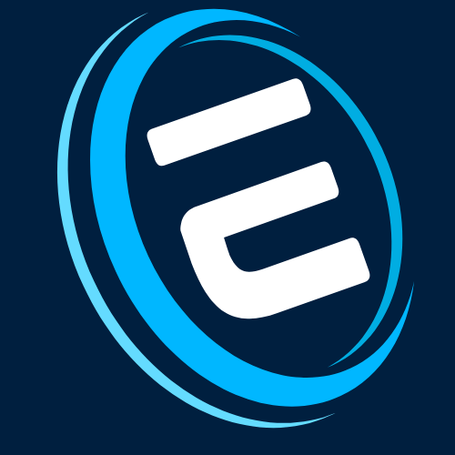

# Open Education Uganda



Open Education Uganda is a modern, responsive frontend web platform designed by Najuna Brian and Jerry Laruba Festus to deliver accessible, high-quality educational resources to learners across Uganda. Built with React and modern web technologies, it offers a scalable foundation for digital learning initiatives.

---

## Table of Contents
1. [Project Overview](#project-overview)
2. [Features](#features)
3. [Technology Stack](#technology-stack)
4. [Project Structure](#project-structure)
5. [Getting Started](#getting-started)
6. [Available Scripts](#available-scripts)
7. [Deployment](#deployment)
8. [Contributing](#contributing)
9. [Developer Documentation](#developer-documentation)
10. [License](#license)

---

## Project Overview <a name="project-overview"></a>

**Open Education Uganda** is a frontend web application designed to provide students with easy access to academic resources and study materials. It features a hierarchical navigation system that mirrors the structure of an educational institution:

`Colleges > Departments > Programs > Years > Semesters > Courses > Materials`

The primary goal is to create a user-friendly, intuitive, and scalable platform for learning.

---

## Features <a name="features"></a>

- **Responsive Design**: Ensures optimal viewing across devices.
- **Hierarchical Navigation**: Intuitive academic structure layout.
- **Search Functionality**: Quickly locate courses and materials.
- **User Authentication**: Basic login system for access control.
- **Modular Components**: Reusable and maintainable code structure.

---

## Technology Stack <a name="technology-stack"></a>

- **React**: A JavaScript library for building user interfaces.
- **JavaScript (ES6+)**: Core programming language.
- **CSS**: Styling using both global styles and component-specific CSS.
- **JSON**: Used to store and manage the academic structure and content.
- **No Backend (Current Version)**: This version is frontend-only; all content is loaded from a local JSON file.

---

## Project Structure <a name="project-structure"></a>
open-education-uganda/
├── public/
│ ├── assets/
│ │ └── logo.png
│ └── index.html
├── src/
│ ├── components/
│ │ ├── Navbar.js
│ │ └── ...
│ ├── pages/
│ │ ├── Home.js
│ │ ├── About.js
│ │ ├── Contact.js
│ │ └── Login.js
│ ├── App.js
│ ├── index.js
│ └── ...
├── docs/
│ └── developer-docs.md
├── .gitignore
├── package.json
├── README.md
└── ...

---

## Getting Started <a name="getting-started"></a>

### Prerequisites
- Node.js (v14 or higher)
- npm (v6 or higher)

### Installation <a name="inatallation"></a>
1. Clone the repository:
```bash
git clone https://github.com/najuna-brian/open-education-uganda.git
cd open-education-uganda
```

2. Install dependencies:

```bash
npm install
```

3. Start the development server
```bash
npm start
```
The application will run at http://localhost:3000.

---

## Available Scripts <a name="available-scripts"></a>

In the project directory, you can run:

- `npm start` – Runs the app in development mode.

- `npm run build` – Builds the app for production.

- `npm test` – Launches the test runner.

- `npm run eject` – Ejects the app from Create React App configuration.

---

## Deployment <a name="deployment"></a>

To deploy the application:

1. **Build the app**:

```bash
npm run build
```
2. **Deploy the contents** of the build/ folder to your preferred static hosting service (e.g., Netlify, GitHub Pages, Vercel).

---

## Contributing <a name="contributing"></a>

We welcome contributions from the community! Here's how you can get started:

1. **Fork** the repository then [clone](#installation) it.

2. **Create a feature branch:**

   ```bash
   git checkout -b feature/your-feature-name
   ```
3. **Commit your changes:**

   ```bash
   git commit -m "Describe your feature"
   ```
4. **Push to your branch:**

   ```bash
   git push origin feature/your-feature-name
   ```
5. Open a Pull Request detailing what you've done.

---

## Developer Documentation <a name="developer-documentation"></a>

For in-depth developer instructions, technical decisions, data structures, and UI interaction guidelines, refer to the full [Developer Documentation](developer-docs.md).

This documentation is especially useful for:

- Understanding the design principles of the platform
- Learning how components and JSON data are structured
- Extending the platform with new features
- Collaborating efficiently with the development team

---

## License <a name="license"></a>

This project is licensed under the MIT License.

---


